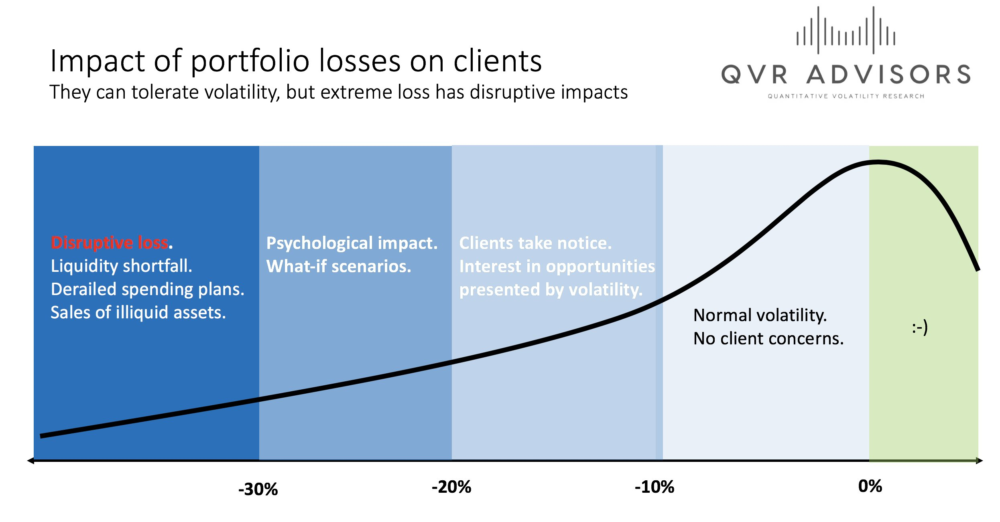
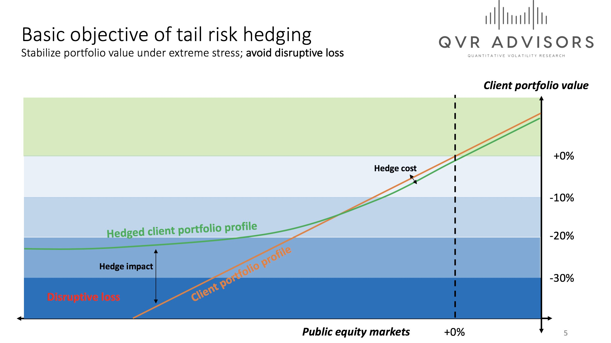
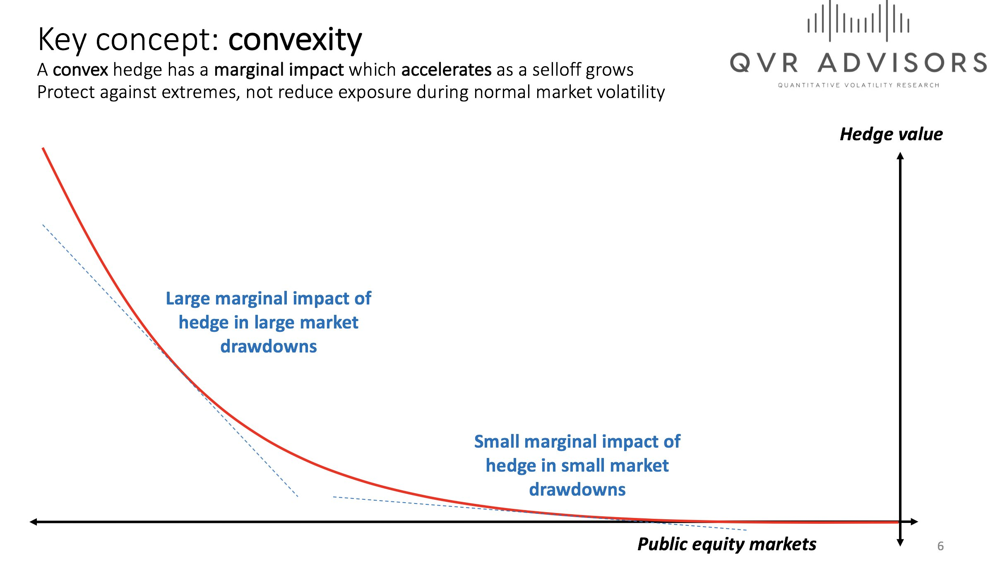
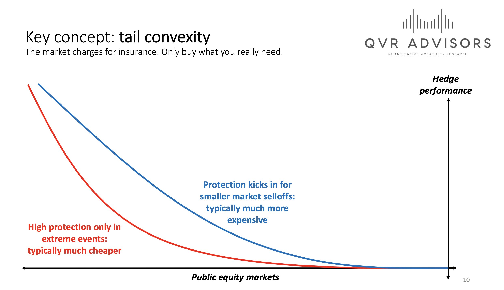
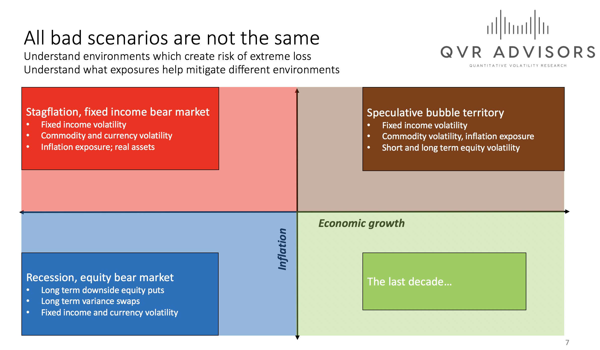
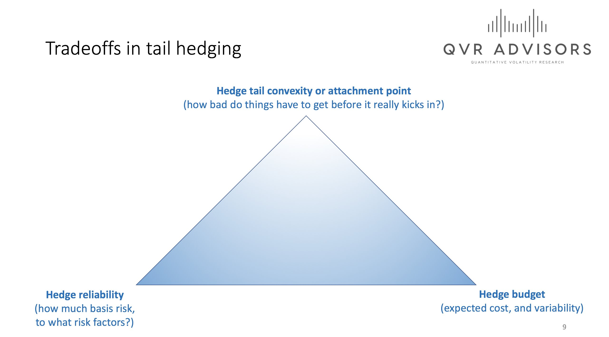
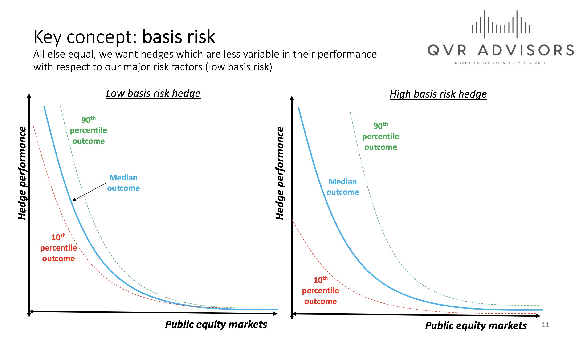

# Tail risk hedging

https://x.com/bennpeifert/status/1256629844634296320 | https://twitter-thread.com/t/1256629844634296320

Let's have a quick chat about tail risk hedging since there is so much loud yelling going on about it.

Why do large institutional clients consider tail hedges? Think back to 2008 when many foundations/endowments were forced to sell private funds at ten cents on the dollar.

Many pensions were forced to sell equities at the bottom, because they had no cash to pay benefits. As a result, they locked in losses at the absolute worst time. Tail risk hedging is about seeking to cut off disruptive loss scenarios which hurt long run portfolio performance.

True tail risk hedges are not just short the market locally. They are highly convex -- they aim to protect relatively little against small drawdowns but a whole lot against big ones.

Long volatility exposures are often expensive if they provide "near the money" protection for a portfolio – e.g. preventing any equity market losses below 5%. That shouldn't be the objective, asset owners are paid to take risk.

They also should be tailored to the particular risks that an institution faces in different economic environments.

There are always tradeoffs in tail risk hedging. Sometimes the cheapest options aren't the ones most directly related to an institution's underlying risk exposures (basis risk).

For example, a 3-month put option on the S&P has very little basis risk for an institution that owns US large cap exposure; the payoff is deterministic at maturity. Longer-term options that depend more on implied volatility increasing to really pay out, there's more basis risk.

Sometimes, when there is too much demand for hedges -- e.g. the five years after the credit crisis, 2009–13 -- there's just no reasonable value proposition, and they should be avoided, and risk just managed to acceptable levels.

But in late-cycle environments (2006–07; 2017–20), the presence of enormous selling of volatility and tails by retail investors and hedge funds has offered great value for institutions seeking to protect from huge crises.