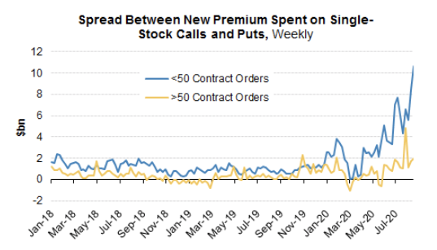
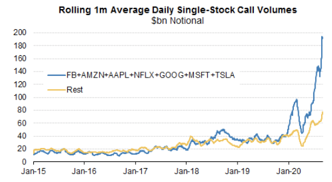
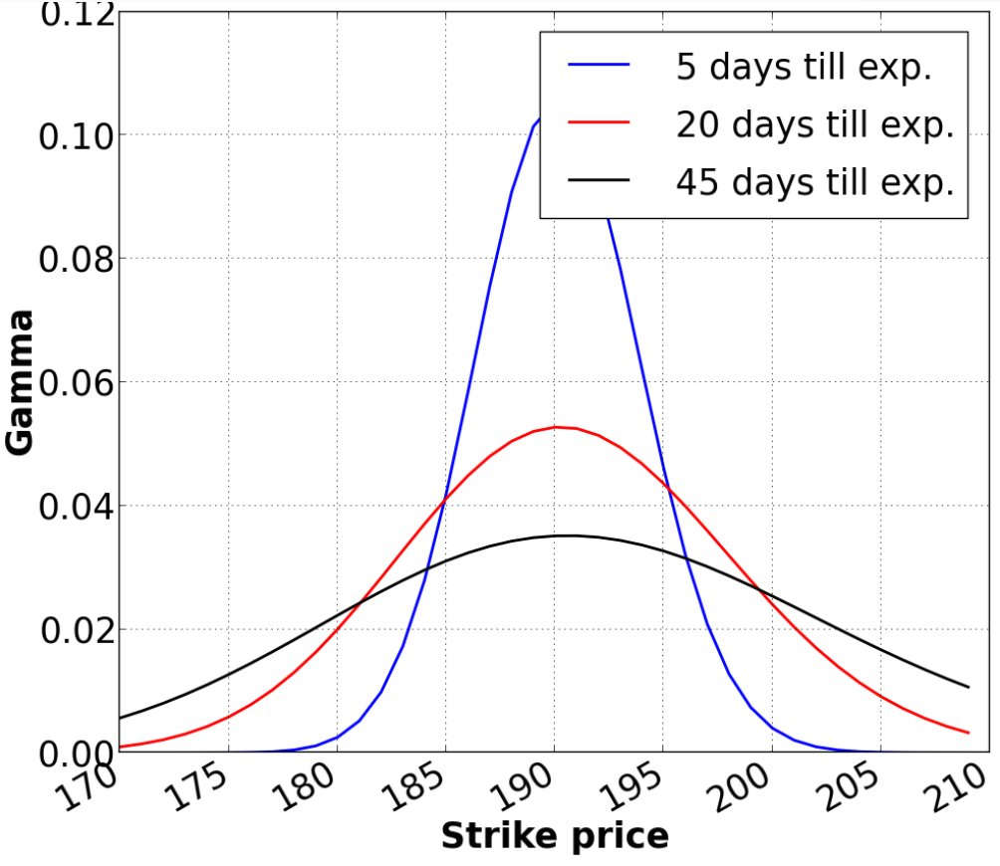
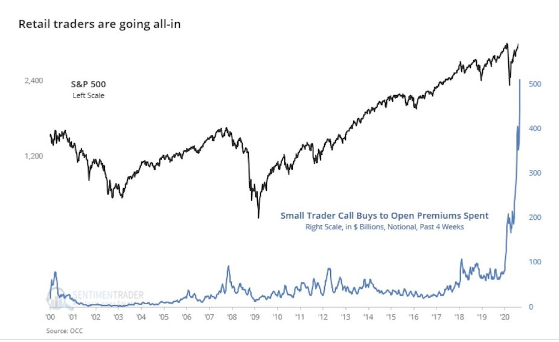
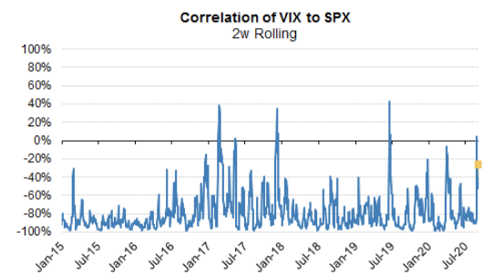

# Retail Speculation and Institutional Call Spread Trades in Tech

https://x.com/bennpeifert/status/1302725084075810817 | https://twitter-thread.com/t/1302725084075810817

Thought I'd clarify a few different mechanisms that are getting confused somewhat:

1) retail speculation and short term call buying ("Robinhood")

2) institutional call spread trades in tech (SoftBank etc)

First, retail speculation. 

OCC data shows small trader accounts bought $40 billion of premium in call options over the last month (h/t @sentimentrader). This is often associated with Robinhood, but that is oversimplifying. Retail option activity is off the charts everywhere.

This activity is heavily concentrated very short term calls (< 2 weeks) mostly on tech/momentum names. 

The important thing to understand is that short term options have a lot of leverage and a lot of gamma when the underlying price is near the strike.

A day trader who bought  a 1-week 3250 call with AMZN at $3148 on 8/14 would have paid about $15. The delta was 21%; the contract she bought is deliverable into 100 shares, so it has the equivalent of 21 shares (or $66,100) worth of AMZN exposure, for only $1500 of premium. Woof.

The market maker who she buys the call from is going to hedge that exposure immediately. (Actually slightly more than that because of skew, but I digress.)

The next day AMZN moved up 1.1% to 3182. As the stock moved closer to the option strike, the call price increased to $15.50 and its delta moved up to 26%. The market maker would have increased her hedge by buying another 5 shares, bringing it to 26 shares or $82,000 of stock.

The next day AMZN moved up 4.1% to 3312. The call price exploded to $81 and delta to 73%. The market maker would have been forced to buy another 47 shares of stock, moving the total value of shares bought to $230,000. Remember, the day trader's total premium outlay was $1,500!

This is how heavy buying of short-term options can accelerate moves in trending stocks. It turns a relatively small amount of option premium into a reinforcement mechanism: stock up --> option deltas move higher --> hedging flows buy the stock.

The example above isn't particularly extreme, and it involved leverage over 150:1 in terms of AMZN stock buying per dollar option premium spent. Consider the $40 billion premium spend from small traders over the last month (h/t @sentimentrader).

Second, the large institutional call spread trades that have been discussed with such excitement the last few days. These total a few billion dollars of premium spend, in 3–6 month maturities, in mega-cap tech names (MSFT, AMZN, NFLX, etc).

At least some of these trades came from SoftBank, though there is also discussion of copycats and front-runners trying to accumulate inventory in advance of anticipated continuation of the flows.

Based on color from flow desks, these trades were mostly executed versus stock, which means that the client bought the call spreads and sold stock, executing a delta neutral trade. So these transactions themselves did not represent meaningful buying pressure on the stocks.

These options are much longer dated than the typical short-term options that are popular with retail. The risk exposure of 6 month options is much more heavily weighted to vega (risk to implied volatility) as opposed to gamma (convexity to spot price changes).

The gamma of these positions was quite small relative to the overall market landscape. Various dealers have produced estimates that are generally similar to ours; maybe a few hundred million dollars of gamma per 1% across the big tech names, too small to have a material impact.

As tech stocks rallied and the option buying continued, these positions put pressure on dealer net vega risk limits, eventually forcing them to cover some of that short vega risk in the market by buying similar 3–6 month NDX and SPX call options.

Meanwhile, heavy demand for option-based protection around and after the election continued, amplified as the rally went parabolic and institutional investors moved to take risk off of the table.

This helped to create the much-discussed stocks up, vol up behavior of late August and early September, where the VIX (and especially the Nasdaq VIX) was trending higher even as stocks continued to rally.

These two effects (the acceleration effects for directional moves, and the spot up / vol up dynamic) are two different effects that mostly relate to two different kinds of end customer flow.