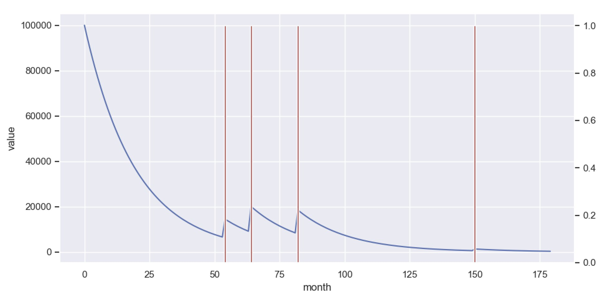
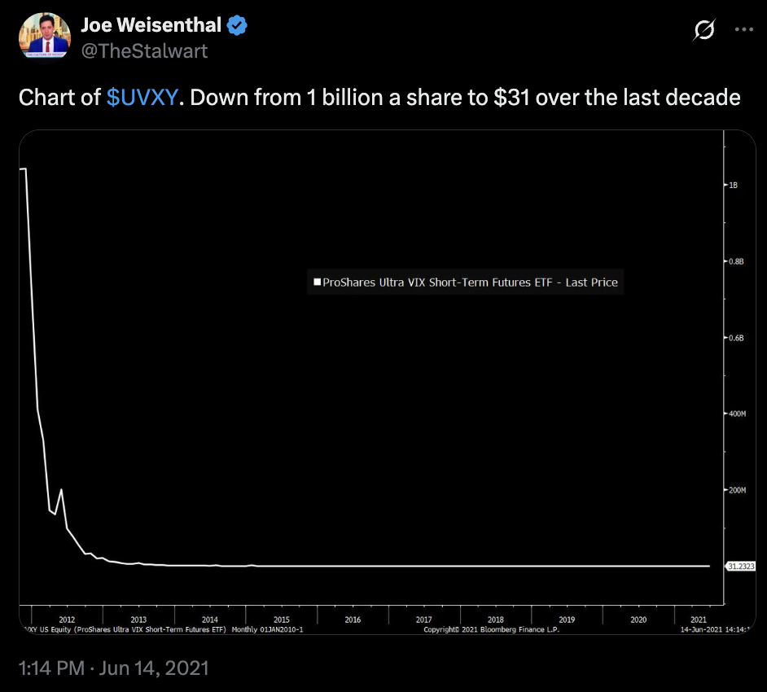
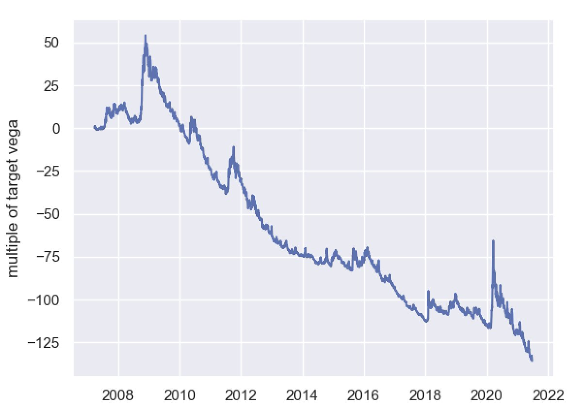

# Understanding VXX and Defensive Assets

https://x.com/bennpeifert/status/1408422697755811843 | https://twitter-thread.com/t/1408422697755811843

Suppose you're thinking about buying fire insurance on your house in Sonoma. You create an insurance fund of $100,000, and you decide that you'll spend exactly 10% of that fund every month on insurance, because you want to fix the maximum loss on your policy over the long term.

The policy pays out 25x your monthly premium in the event of a fire. The actual probability of a fire is only 2% per month, so there is a risk premium here, but you're willing to pay it because losing your house would really suck.

How does this insurance strategy work out?

Well, most likely there's no fire for a while, and your insurance fund is shrinking as you pay out premiums. Since you're only buying 10% of the remaining fund value in insurance every month, your protection against a fire is falling.

Eventually, when there's a fire, the value of your insurance fund only recovers a small portion of what you've already spent on insurance, and your wife tells you that you're a blithering idiot.

What's going on here? You're not buying a constant amount of insurance over time; you're cutting the size of your policy over time as you spend premiums, in order to achieve mechanically limited total insurance spend over any time horizon.

Of course, that makes absolutely no sense as a way to implement an insurance policy, your wife is correct that you're a blithering idiot. What you'd probably instead is target your insurance premiums and payouts relative to the value of your house.

This, of course, is why it's totally uninformative to plot the price of a single share of a security designed as a hedge, which is expected to be negatively correlated with the market and convex, and therefore to lose money over time on a standalone basis.

(Joe obviously is just trolling here, but part of the reason why it's funny is that there are countless people who unironically post the same thing)

The correct thought experiment is holding a constant amount of exposure of that hedge as a percentage of your equity portfolio, measured in terms of market value or risk (vega). This is analogous to targeting your home insurance policy relative to the value of your house.

