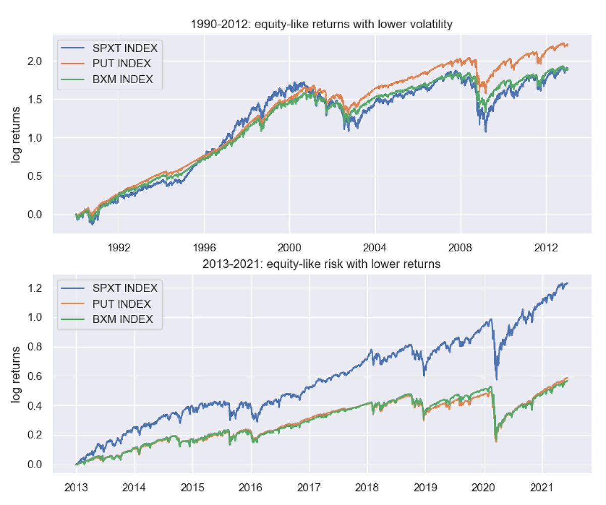
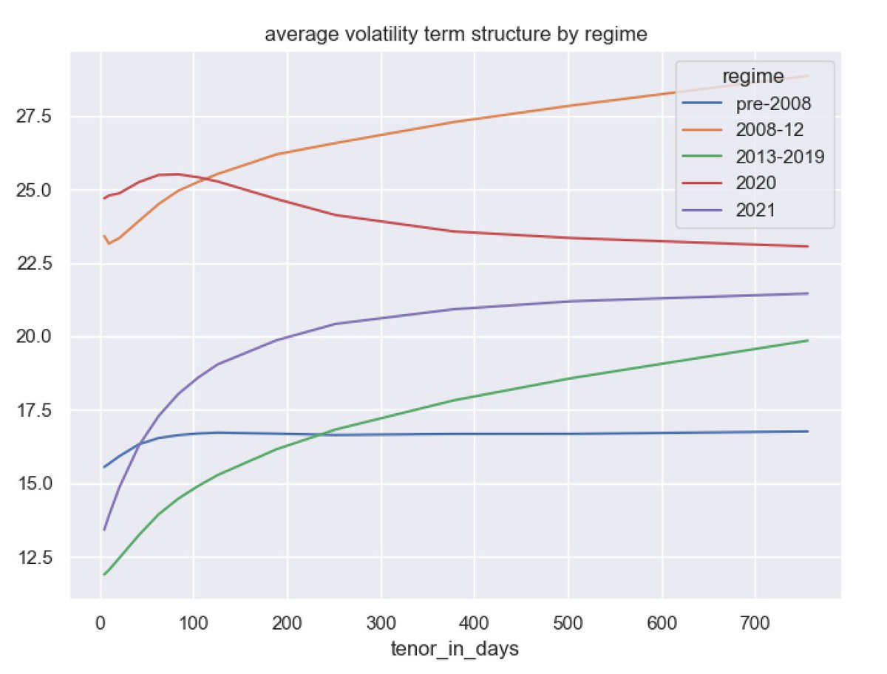

# Does a systematic buyer of calls have an expectation of breakeven or positive P&L?

https://twitter.com/bennpeifert/status/1474022429307531272

Prompt:
> If one is a systematic buyer of SPY calls over time, for a period of years (don't even worry about what strikes), would one have an expectation of breakeven P&L, or an expectation of making money because stocks generally go up?

simply, a long position in a call option on equity has

1) long equity exposure
2) positive payoff asymmetry (gamma)
3) negative time decay

a long position in a put option has:

1) short equity exposure
2) positive payoff asymmetry (gamma)
3) negative time decay

Exposure #1, good old fashioned equity beta, is associated with positive expected returns if you're long and negative expected returns if you're short. 

Exposures 2-3 together are associated with something we typically call the volatility risk premium (or, if the option is longer term, maybe a combination of VRP and volatility term risk premium, but lets ignore that for now). 

Because positive payoff asymmetry is always a good thing, especially in a portfolio context, 2+3 should together have negative expectancy over time on a stand-alone basis. (This might not always be true conditionally, but should be true on average.)

So the long-term average returns of a systematic long position in call options will depend on the relative size of the equity risk premium (which adds +) and the volatility risk premium (which detracts -). 

(Worth noting, typically the volatility risk premium is measured in terms of the volatility of daily or intradaily returns, because the equity exposure of an option can be hedged out easily. So for unhedged options held over time, return momentum / mean reversion also matters.) 

During periods of time where VRP is high, it may entirely (or more than entirely) offset the equity risk premium in call options. This tended to be true pre-2012 when option markets were small and large-scale option selling not yet popular. 

During periods of time where VRP is relatively low, such as post-2012 when we started to see large scale institutional adoption of call write and put write strategies, you tend to see equity risk premium (+) dominating VRP (-) in call option returns. 

One easy way to see this is in the difference between S&P total returns and BXM (the benchmark S&P call overwriting index, long equity + short call). Call write performance tracked equity total returns pre-2012 (e.g., call option buying was a wash), but dramatically lagged since.

To be clear, BXM is long equity + short call, so the stand-alone performance of 1-month call selling is BXM minus SPXT (e.g. about flat 1990-2012, massively negative 2013-21). 

Since put options have equity risk premium and volatility risk premium exposures that go the same way (e.g., a short position is long equity and short volatility), one does not have this push and pull between two different risk premiums. 

So over time one should generally expect put selling to have positive returns, from a combination of long equity exposure and short volatility exposure. 

Short term put option writing (e.g. PUT INDEX) roughly tracked the total returns of equities pre-2012, and then continued to make money but at a much slower rate afterward. 

Note that the difference between long term call option selling returns and put option selling returns, for similar strike ranges, does not have anything to do with "the demand for insurance" or behavioral factors etc. 

It is literally just that puts are short equity and calls are long equity. Long equity plus short at the money calls is roughly the same thing as short at the money puts (by put-call parity). 

The modest difference in performance between BXM and PUT pre-2012 comes from idiosyncratic factors, mostly settlement (the S&P special opening quotation against which the options settled tended to be high relative to rest of day index prices).

https://cdn.cboe.com/resources/indices/documents/bxm-put-conundrum.pdf

Note that the statement that "selling put options *or buying stocks and selling calls) should generally have positive returns over time" does not equate to "one should sell put options". As always, you need to think about the portfolio context and the opportunity cost of capital. 

As in the graph above, call write and put write strategies had roughly the same downside risk (down capture) as the underlying equity market, with much less positive performance in up markets. 

In a portfolio context, adding negative convexity strategies with low returns to the upside and high correlation to risk assets to the downside is generally not additive to portfolio performance. 

Were the relatively poor returns of these strategies in the recent decade just bad luck? Take a look at what volatility term structures tend to look like in the last decade, versus previously during high-VRP periods, and that should answer your question :)

Rule #1: if you run a backtest on a long historical time period where the relevant market was small and the relevant strategy had no material institutional capital, you will get a very different answer than the go-forward answer when institutional capital shows up...
