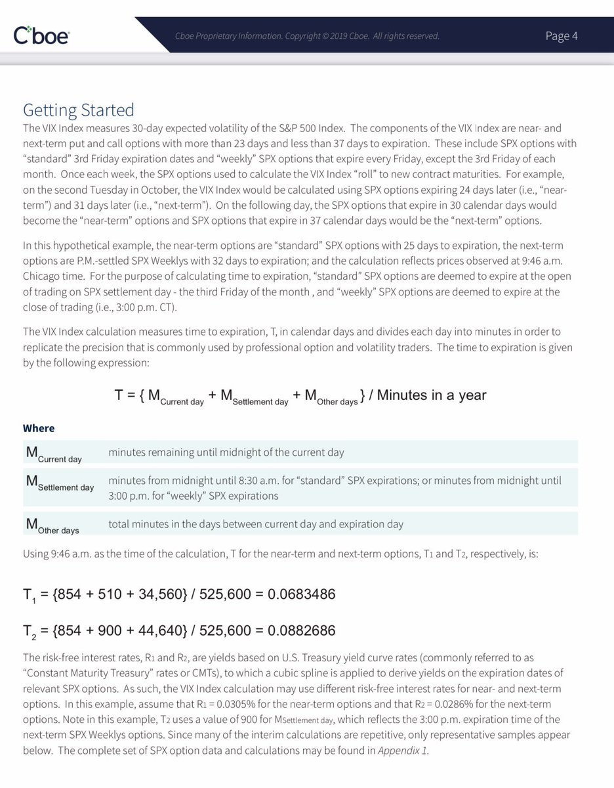

# VIX index calculations and weekends

https://x.com/bennpeifert/status/1570759229514055681 | https://twitter-thread.com/t/1570759229514055681

happy friday everyone. instead of making snarky comments on "why is vix weaker than i expect" tweets, i'll just re-explain this.

vix index is (the square root of) a particular 1-month implied variance calculation based on option prices. such calculations are always annualized.

annualization scales the units to (the square root of) variance over a 1-year period, in order to make implied variances over different time periods comparable.

to do this, we need a convention for what fraction of a year's variance is elapsed between now and option maturity. 

if the market was open all the time and the arrival rate of variance roughly constant, then it would make perfect sense to just count the number of minutes until expiration divided by the number of seconds in a year, for example. 

this is essentially what the vix calculation does. but the market does not treat volatility this way. we know that variance arrives faster when the market is open than on weekends and holidays, for example.

market makers and arbs have detailed variance calendars both for handling market open vs closed and also for different periods of time during the day (eg there is more variance per unit time around the open and close than mid-day. 

Benn, you say, ok what does this have to do with Fridays and VIX? Getting there. VIX is a 30-calendar-day maturity variance calculation. On a Friday, the subsequent 30 calendar days have one more weekend in the window than the 30 calendar days following a Monday. (Light bulb?) 

So for example 20 trading days instead of 22 (depending on holidays etc). if variance only arrived on cash market trading days, the market would assign an annualization factor to implied vol calculations that is different than that used by VIX by sqrt(22/20). 

that is, VIX would simply go down on friday by around 5% relative to properly calculated (according to the variance calendar) implied volatility the market uses. this is a pure optical illusion. 

in practice there is some arrival of information and variance during nontrading periods, just lesd than when the cash markets are open. there was a discussion on that a while ago with @moreproteinbars that I cant find. so the effect is less than 5%, more like 3%.

to reiterate: VIX just goes down, in an illusory fashion, in a way that does not relate at all to actual market prices of options or to how market makers or arbitraguers calculate implied volatility. The opposite happens on Monday. its just a fugazzi. 

This effect is exacerbated for 3-day weekends etc.

happy friday, good luck and spend your brain cycles trying to figure out how to take out Astel's reincarnation with a melee build instead of fretting about VIX 
