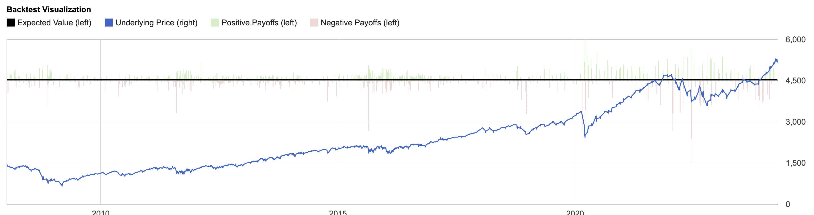

# Derivatives trading intern question

## Question

https://x.com/bennpeifert/status/1882486209928405399

Derivatives trading intern question: what is wrong with this statement?

> $300,000 is the minimum amount you need in order to make six figures from options selling. 
> 
> This is based off making .8% per week from premiums combined with capital gains. 
> 
> Selling options will unlock many doors for you financially.

## Answer

https://x.com/bennpeifert/status/1882663094876532988

Feel like I shouldn't need to answer this seriously, but I will for the people in the comments.

He's conflating option premium sold (an assumed 0.8% per week) with income from the strategy. But when you sell options, some of the time they expire in the money and you lose.

The immediate response of the r/thetagang option sellooor is "but I'm happy to take delivery of the stock down there!". I mean, sure, but if you sold a $100 put and the stock went down to $90, then you lost $10, you could have bought the stock at $90 but you sold the put instead.

He says "premiums combined with capital gains". Since he's just talking about option selling, he must be implying something like the Wheel strategy, where if you get exercised on puts and get long the stock you then own it and sell calls against it

But it's not like you can make capital gains on top of your total option premiums from this -- any capital gain you're making on stock you got from a put being exercised against you is 1) just making back a loss on the short put, and 2) lost back on the call you sold against it

Of that 0.8% average weekly premium amount he cites, you'd be lucky to average 0.1% actually retained on a net basis, that would be a great outcome

This is roughly what weekly option selling looks like (straddles). The sharpe ratio is 0.11, much worse than just owning equities.

