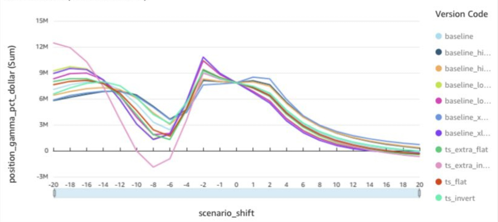

# What views would you want to see to assess real-time risk?

https://x.com/bennpeifert/status/1882835524785942910

Question from DMs: what views would you want to see to assess real-time risk?

> I mean beyond the usual 99% VaR/CVaR, and historical crisis episode simulation i.e. how the exact spec of the portfolio as is would have fared under those scenarios?
> 
> Would you want to perform a 20% spot down 1-day shock? Just don't like the many assumptions around how each delta 1 instruments would behave in that env...
> 
> Just curious on what you would want to 'wake up to' on your risk management dashboard

Answer:

> Yeah, slide risk, exactly. That's the #1 thing
>
> so what you want there is a set of calibrations of how vol surfaces move with your benchmark index
>
> several different calibrations of benchmark vol surface moves as a function of spot
>
> term structure more inverted vs less, skew steeper vs flatter, bigger vol move vs smaller
>
> and then move all other spot and vol surfaces on a beta to benchmark

PNL and Greeks slides looking like this:

