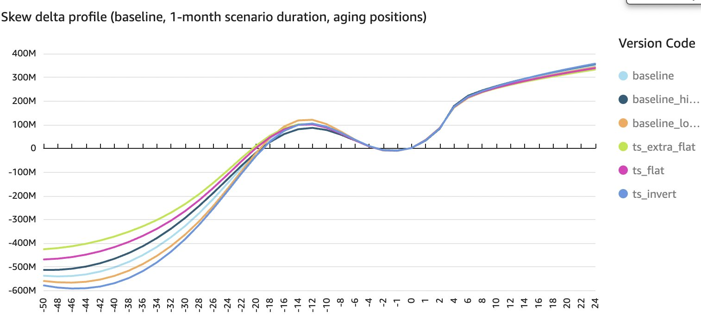
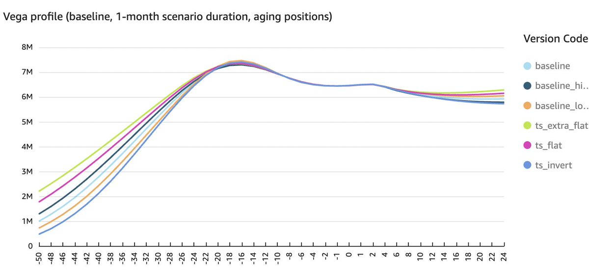

# Junior derivatives trader interview question

## Question

https://x.com/bennpeifert/status/1886817849416802395 | https://twitter-thread.com/t/1886817849416802395

Junior derivatives trader interview question: what kind of position would generate a delta slide profile like this? 

## Answer

https://x.com/bennpeifert/status/1886892524310290682 | https://twitter-thread.com/t/1886892524310290682

hint: this trade structure has two legs (plus delta hedge)

All right people had a lot of good ideas here, but it's a diagonal put calendar, short slightly downside near term puts, long a lot more of deeper out of the money long term puts, delta neutral!

notional on the long term puts is a lot larger than on the short terms

Let's walk through a bit of the logic here. This is clearly not a single vanilla option, you have multiple reversals of convexity. Notable features:
- delta rising to the upside at an increasing rate to about +4% and then at a decreasing rate above
- delta rising to the downside at an increasing rate to about -6% and at a decreasing rate to about -12%, then falling at an increasing rate to about -22% and at a decreasing rate below that
- slightly subtle hint, but several different stress slide calibrations hinting at different levels of inversion of the term structure, which have large impacts on the delta profile, suggesting calendar spread exposure

Many people thought along the lines of layering in various spreads and butterflies in the same maturity to achieve roughly the delta profile shown, that's reasonable, but the trade is simpler. That's why I added the hint (2 legs only)

Someone else added for the vega profile as a hint, now that's a dead giveaway of what's happening

To get the mild short gamma to the downside that's reversed and replaced with much more long gamma further down, and with the strict long convexity to the upside albiet at a decreasing rate, in a 2-legged trade, that's going to mean a calendar put ratio

With a much smaller quantity of a much shorter dated downside put option short, and a larger quantity of a much longer dated put option long, and with a delta hedge

Obviously I say puts, put-call parity is a thing of course they could be calls instead against the appropriately different amount of delta
