# The White Space Of Quantitative Trading

https://x.com/systematicls/article/1796598383907672209

## Executive Summary
The prevailing reigning models of quantitative trading firms - MFT or HFT, are likely pushing up against the limits of their competitive advantage. We can observe that steps are being undertaken by firms of both models to expand their core competencies into each other’s domain.

We argue that the space between the two behemoths is a relatively unexplored space that is sparse of clear winners, and that future market leaders in that space are unlikely to be the firms of old, and instead, start-ups that are built with the express purpose of competing in that space.

Finally, we show with trivial extrapolation, that even with a small chance of success in capturing a small segment of the market, the economic rewards (~$1B gross revenue) make it worthwhile to mount a serious attempt.

## Landscape

The dominant players in the quantitative trading space can be largely bucketed into either the mid-frequency-trading (MFT) or high-frequency-trading (HFT) firms. When we refer to firms, we mean either commingled research firms or pods of significant size, and will use “firm” to represent both.

There is a distinct difference in the strategic focus of MFT vs HFT firms since their primary competitive advantage differs.

The primary competitive advantage of MFT firms is prediction fidelity over the medium-long term (days to weeks) using economies of scale in complex models powered by a large collection of datasets, while the primary competitive advantage of HFT firms is reaction time over the very short-term (nanoseconds - microseconds) using technologies that are hyper-optimized for speed.

The quintessential example of an MFT firm is TwoSigma, which utilizes thousands of datasets to make many signals, that when aggregated, have impressive prediction fidelity over the medium-long term. The quintessential example of an HFT firm is Optiver, which uses its technological advantage to make markets globally with minimal latency.

## Axis of Competencies

A comparison between the two reigning camps in pictures.

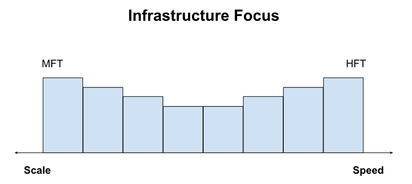

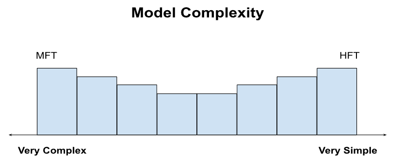

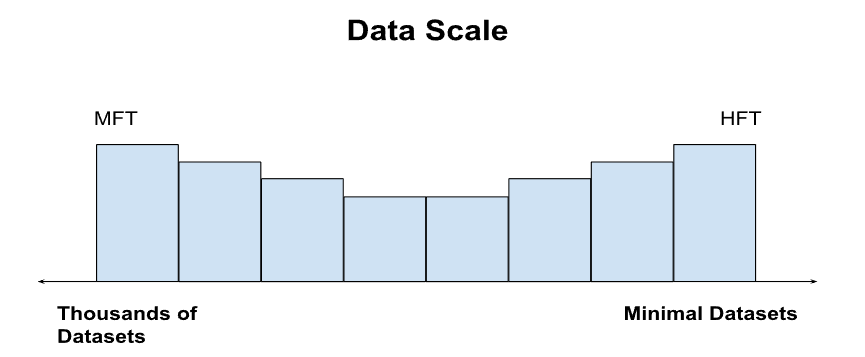

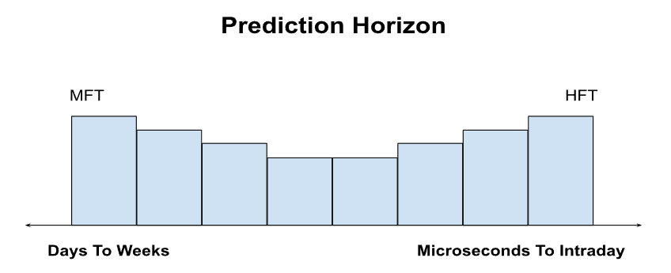

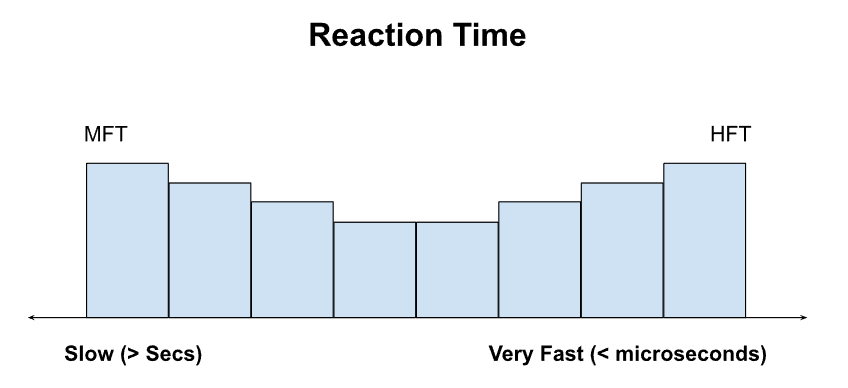

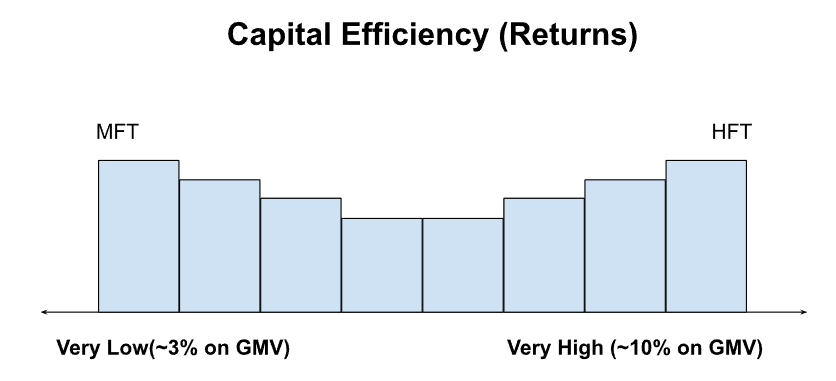

## Shifting Landscapes

As behemoths in both the MFT and HFT space find saturation in their segments of the universe, we see a deliberate attempt in each camp trying to move into the other’s core competency.

## MFT Impact Problems

For MFTs, dealing with large amounts of capital with a relatively inferior execution system shows up in having a large market impact, and high slippages. This adversely affects their transfer coefficient, and represents a natural gravitational pull on their PnL.

The larger they grow, the stronger the pull. As such, there has been growing emphasis among MFT firms to spend time on researching market microstructure, market impact, and short-term predictions to mask information leakage and exploit short-term mispricing.

## MFT Strategy Crowdedness Problems

Likewise, the previous crown jewel of MFT firms used to be the secret, unobvious signals. Strategies that were derived from well-designed models, taking in datasets that were non-obvious, expensive to procure, or required a great deal of effort to attain (iykyk).

The spread of strategies also used to be slower, and more contained. Generally, there were a few places that represented the quintessential strategy (e.g. PDT and DEShaw for statarb, GS for index rebal, etc).  Retail remained clueless as to how the sausages were made as usual - but so did the institutional players, outside of the originator shops. As talent from these originator shops left, they brought know-how to competitors and sprouted a new team/division running the same strategy with some idiosyncrasies.

Today, with the proliferation of strategies and major players all around the globe, coupled with the advent of multi-managers, where (relatively) low-cost teams are free to iterate on an unfinished idea until it is monetizable, there is practically no more strategy that is unknown and purely idiosyncratic. Consider the taxonomy of strategies in a multi-manager’s risk department, we have such a complete mapping of how every strategy looks like, how it’s implemented, and even have the vocabulary to describe their minute differences.

Our principal argument is that every conceivable strategy now has a strategy factor component + some idiosyncratic component that comes from the craftsmanship of the implementor in the environment he is in, coupled with the infrastructure he has at his disposal; and that the percentage attribution of factor component of all well-known strategy is growing every day.

Likewise, on the data front, exclusive data privileges are rare. Competitors are offering copies upon copies of the same data to the same firms. We’ve had data vendors inform us that new datasets are being used by competitor X, and we should probably take a look as well. Anyone who is from a credible firm has the same ideas about which datasets contain value.

Further, as strategies do well, firms rush into them, and via the strategy factor, push the returns of the strategy further from impact. Returns from this impact on the strategy factor are not sustainable, and eventually collapse. Teams are then cut and bring know-how to other firms (tier 1 -> tier 2 moves are extremely common), further increasing knowledge diffusion. Logical conclusion: the competitive edge that comes from secrecy and exclusivity is fading.

## MFT Rectifications

The state-of-the-art for MFT firms is to agglomerate as many strategies as possible under one roof. Multi-managers agglomerate pods of every conceivable strategy, and pods themselves seek to agglomerate as many different strategies as they can (within the limits of their mandate). Since uncorrelated strategies will increase performance due to diversification, pods that want to maximize their economics will seek to diversify strategies.

This is a natural conclusion on the state of the game, we think, if there are no more secrets to be had on the strategy front, then there is less incentive to be closed. The game shifts from a closed environment trying to protect the secrecy of one strategy, to being an open environment, trying to acqui-hire as many strategies as possible.

Here is Two Sigma, with a series of job listings in statistical arbitrage, index rebal, and equity options - strategies that have little to do with each other. There is nothing inherently special about Two Sigma as an example, except that they more transparently describe the job responsibilities in their listings. Virtually every MFT firm is hiring along the same profiles, just under obfuscated titles.

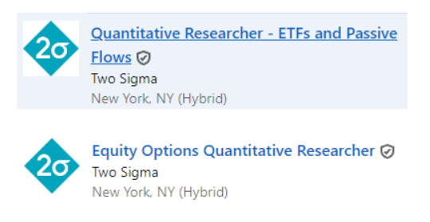

With increasing amounts of data and a better understanding of how complex models fit into the quantitative landscape, we see a gradual, but distinct shift toward complex models.

The folklore that success can only be found in simple models has started to quieten down. As usual, retail is about a decade behind and has finally caught on to the “everything can be solved with linear regression”. Meanwhile, all around MFT land, firms have either found success in highly complex models or are conducting large-scale experimentation.

Here is Two Sigma hiring machine learning engineers and quantitative researchers focusing on machine learning.

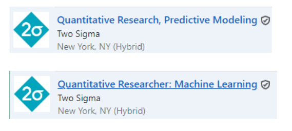

For the typical MFT core competency of scale in data and models, infrastructure needs to be built from the ground up to support such scale.
There are strong architectural constraints on the scale required to 1) ingest and process so many data sources to support such diverse strategies, 2) compute signals and portfolios for all of these strategies at once, as well as 3) figure out the best way to net the positions of these strategies and to maximally utilize information from these disparate strategies for internal price discovery.

MFT firms are also working on short-term price predictions and investing in technology to bring the impact of information leakage and slippage down. Eventually, as strategies get increasingly crowded, the competition for liquidity will get squashed into a smaller and smaller timeframe. We can draw this conclusion by looking at HFT at the extremes, when both our strategies are obvious and transparent, the primary competitive advantage is speed.

Here is Two Sigma hiring software engineers and researchers in the high-frequency trading space:

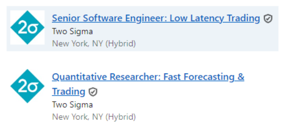

Lastly, We have heard of at least one large, reputable firm experimenting with strategies that are outside of the taxonomy of known, successful quantitative strategies; namely, in the prediction/betting markets. This seems fairly logical - when strategies in the land of the public markets are all becoming crowded, moving out of the zeitgeist seems like a good step to discover a new competitive edge.

Here is SIG, hiring for a quantitative researcher in the sports betting markets.

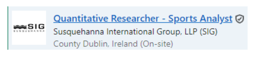

## HFT Problems

The pains of crowdedness in strategy are similar but have never really been of contention to begin with. How secret and obscure can a strategy that bets on the mispricings between an ETF and its constituents really be?

From what we can observe, HFT firms have always overcome the relative transparency of their strategies with extreme technological superiority; rather, all the secrets are in the technology. In 2017, Optiver revealed that a good wire-to-wire time was around 2.5 microseconds (2.5 microseconds is about the time it takes for light to travel from the spire of the Burj Khalifa to the ground)

and a more recent talk in 2022 revealed that the average HFT participant was at 10 nanoseconds (10 nanoseconds is the time it takes for light to travel from the stage of an auditorium to the first row of the audience).

We would postulate that the diffusion of knowledge in the HFT space has also been widespread, except that instead of the knowledge of strategies, the proliferation has been in the knowledge of technology. Also, an obvious problem for the HFT firms is that there is a limit on the physics of speed in our universe, and it looks to us like they are pressed up right against it.

## HFT Rectifications

Here is what we can logically deduce from the small amounts of interactions we have with HFT teams.

The general consensus is that pushing for speed is a losing proposition - for the simple reason that there are strong limitations on the physics of going faster. It seems that most of the large HFT players are moving towards complexity, the kind of complexity that has been the competitive advantage of MFT firms since their dawn. They then, of course, by extension, inherit the problems faced by MFT firms as described above.

Here is Jane Street hiring for fundamental, discretionary analysts that typically come from banks, and do not even require programming:

Here is Optiver, hiring for quantitative traders in the mid-frequency statistical arbitrage space:

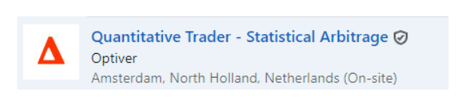

## The New Ideal

We postulate that as both MFT and HFT firms congregate towards a middle ground, the new platonic ideal of a quantitative trading firm is as follows:
1. Market-agnostic, high-complexity models
2. Utilizes (alternative) datasets at scale
3. Can make intraday predictions at high fidelity
4. Very short reaction time (low tick-to-trade)
5. High capital efficiency
6. Achieve breadth over a large number of uncorrelated markets
7. Achieve breadth over a large number of uncorrelated strategies

Of course, the ideal is not easily achieved, and by and large, despite innovations, the core competency of MFTs is still their prediction fidelities at the daily-weekly range and the core competency of HFTs is still their extremely fast reaction times.

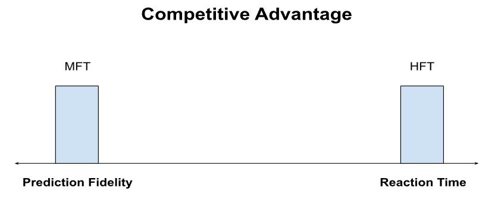

## Is Innovation Towards The Platonic Ideal Difficult?

Our primary argument is that it is nearly impossible to do so without rebuilding large swathes of infrastructure that previously cemented their competitive advantage.

The HFT core competency of having infrastructure that is built to be extremely fast is only concerned with very short-term predictions, that are produced by very simple models which do not require many datasets (or even have many datasets at that timeframe). Large complex models or having to deal with many different datasets from different vendors slow down the entire infrastructure.

Conversely, the MFT core competency of high fidelity at the daily scale requires large complex models ingesting large amounts of data covering all aspects of the trading universe, and the corresponding infrastructure to handle these idiosyncrasies. Infrastructure built for such purposes tends to be highly parallelized across distributed systems that are required to wait for each other in some synchronous manner and are thus significantly slower than their HFT counterparts.

## The Rise of The New Ideal

Our natural conclusion is that over the next decade, the prominence of firms of the new ideal variety will be significantly more pronounced - and with it, a bolder prediction that they are unlikely going to be the result of the transformation of the firms of old today with their respective niche.

It is unlikely for the same reasons why tech firms can be disrupted - because monoliths are slow, prone to politics that resist change, and have a perception that the route towards a sensible pivot is to “not break what is working” and incrementally replace infrastructure and/or add business units.

We think that the route of incremental change is going to be long, tedious, and fraught with the danger of going on a road trip to nowhere.

Instead, they are likely going to be the result of start-ups that recognize that there is whitespace in the market to compete. Each of these start-ups will have a tilt towards either the MFT or HFT space, depending on the composition and beliefs of the initial team, but by and large, will likely approach building the business with an emphasis on:

1. Having the technology to ingest, process, and feature engineer large amounts of data
2. Know-how in running large, complex models at scale in production, that
3. Have high intraday prediction at high fidelity
4. With sufficiently advanced technology that has extremely short reaction times to
5. Compete/make liquidity at the intraday with an information-orientated advantage
6. Able to horizontally scale their advantage across markets to increase breadth and achieve economies of scale in their stategies
7. While achieving a very high capital efficiency

## Is It A Worthwhile Market To Compete In?

Absolutely.

The global stock market is trading at ~$100T volume annually, whilst cryptocurrency has an annual trading volume of ~$30T. Assuming that a firm endeavors to capture only 1% of the combined trading volume, it is still a respectable ~$1T of trading volume. Assuming a gross margin of 1bps per dollar traded, it works out to $1B in gross revenue. This also excludes fixed income, forex, and commodity markets, sports markets, prediction markets, private markets, and other niche markets.

The rewards are so great for capturing even a tiny slice of a gigantic market that trying to disrupt is a necessity. It is not trying and letting the incumbents get comfortable that is an abomination. If there is even a small chance to make meaningful progress and compete for market share, a rational agent with the appropriate know-how should leap at that chance.

## How Would A Start-Up Compete?

This has been a worthy question that we have been stewing over for years, and we think we have an actionable roadmap toward building a new-age quantitative trading firm.

Stay tuned to find out more!

