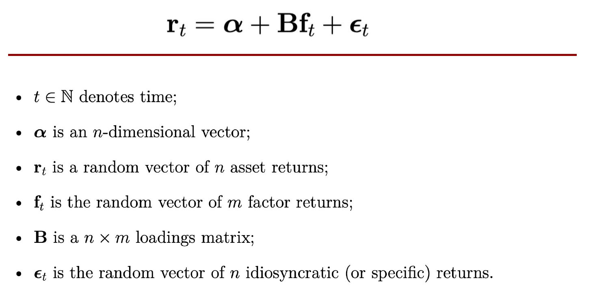
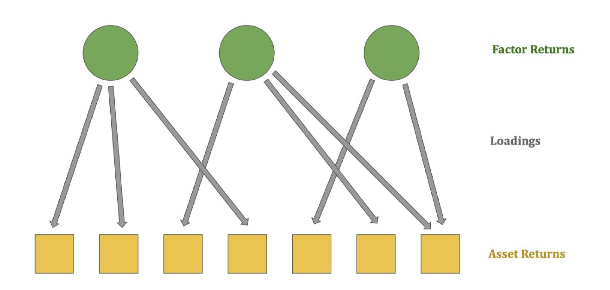

# What The Fact Are Factors?

https://x.com/systematicls/article/1799941636618867011

## Introduction

If you are a buy-side careerist, or if you have hung around spaces discussing systematic trading long enough, you will eventually have heard of factors. I think the topic of factors is pervasive, but in my opinion, typically presented unintuitively.

I hope to provide an intuitive introduction to factors, and to convince readers that there is a logical, intuitive reason for why factors exist and what we can do with factors. I will assume you have consumed at least some introductory material on factors - this is probably not a good introduction. The material here is not "commonly accepted", it may even be perceived as heresy.

I am going to skimp on all the math, I'm going to skimp on all the rigor. I'm going to pretend that I need to convince you of the importance of studying more about factors in the 10 minutes we have.

## Summary

My (apparently controversial) take is that factors arise from specific trading patterns in trading baskets. These specific trading activities inject information into the prices of the instruments' trading baskets and is thus why factors are said to "systematically partially explain the price movements of instruments".

Because factors are a systematic source of returns, we say that all returns can be decomposed into two components, a systematic component, and an idiosyncratic component. Being able to decompose our portfolios in such a similar manner allows us to construct a portfolio with only the exposures we want, whether or not we are trying to put together a portfolio of factor exposures, or one devoid of them.

I then explain that individual factor returns are cheap (cost of an ETF) because their construction methodologies are typically well-known, and they pay for persistent positive premia by having any permutation of the following properties: 1) lower sharpe, 2) higher variance, 3) high drawdown, 4) low capacity, 5) low returns.

On the other hand, idiosyncratic returns are typically composed of factors that have less well-known construction methodologies, and we typically call these factors signals/alphas, depending on which circles you belong to. These signals are correspondingly more expensive (cost of hedgefund fees).

## Overview

All returns can be linearly decomposed into a systematic component (BF_t) and an idiosyncratic component (a + e_t). We tend to call the systematic component returns due to factors.

This decomposition allows us to manipulate our portfolios to construct portfolios containing returns streams that we want. Think of it as being able to make the subway sandwich of your choice, versus being handed a sandwich with every ingredient mixed in, possibly with some dishwasher soap.

When we talk about factors, we refer to factors that we can identify and construct a portfolio for, that is, **these factors have to be known**. When we do not know the factors, even if they are a systematic source of returns, we tend to lump them into the idiosyncratic component.

My personal belief is that the true idiosyncratic component is (comparatively) vanishingly small, and is persistently 0 on most days; and that deviation from that behavior in empirical tests is because our factor models are underspecified - there are many factors we simply do not know about.

## Why Do Factors Exist?

This is probably bad science, in part because what I'm about to say cannot be trivially falsified. But, I believe that factors are the result of specific trading patterns in specific baskets of instruments. The more prevalent this trading is, the more the factor explains the cross-section of the instrument returns.

Consider the market factor, for example, the factor that explains the greatest variation in stock returns. It is composed of a portfolio that is long every instrument in the market, weighted by the market capitalization of the instruments.

What is the most trivial form of participation in the stock market? Yep, buying an ETF of the market index, weighted by market capitalization. Specific trading in a specific basket of instruments.

Take, for example, the millions of stock market participants buying an index-like portfolio, an "indexing strategy", if you will. Every market participant will have a different interpretation of how to implement this indexing strategy, some will buy an ETF and be done with it, and some will inject some discretion in the size of the individual positions in the index. But by and large, because of size constraints, trading frictions, and ease of an ETF, we will expect that a vast majority of them will have a similar overlap - the value-weighted index. I like to think of this majority overlap as the quintessential positions of a signal/strategy, and that factors are just known signals/strategies.

We have country/industry/sector indexing signals/strategies leading to country/industry/sector factors. We have style factors that represent all popular, known strategies. The most popular one of them all is probably Buffet's value strategy, the value factor. There are many implementations of the value strategy, but they share a commonality, the belief that stocks with high book-to-market will appreciate in price. This commonality must result in a majority overlapping positions between all disciples of value. 

Factors will thus continue to exist as long as there is continued interest in the overlapping trading patterns, in an overlapping basket of instruments. For the most part, factors are just spent, known strategies, but, not all factors are the result of known strategies - as long as there is persistent overlapping trading activity in a specific basket of instruments, it will show up as a factor.

## What Do Factors Do?

Factors explain the cross-section of instrument returns, this means that you can attribute some returns of an instrument to a specific factor. If you specify your model with enough factors, you will be able to attribute most returns of an instrument to factors.

Again, this cannot be falsified, and it's probably bad science, but I believe that factors drive returns, and are causal rather than explanatory. Factors show up in the cross-section of instruments because the specific trading activities cause an impact on the instruments of the specific trading baskets. These impacts cause prices to change.

I think it's pretty intuitive to think of it this way. On the basic example of a market index, if there is net selling by the indexers on a particular day, the market factor will have negative returns, and all instruments in the market will be affected by their (positive) loading/exposure on the market factor.

I haven't yet thought of an intuitive rationale for why loadings are the way they are. Example, why are some stocks more sensitive to market returns? Let me know if you've thought of any!

## Why Should I Care?

Here's my favorite part - you can decompose your instrument returns into factors you know about (systematic), and everything else (idiosyncratic). These factor exposures are linearly additive, so you can do a weighted sum of your instruments' exposures to get your portfolio exposures.

Because you can do this, and because you know your factor portfolio positions, you can quite trivially remove the exposures of your portfolio, by forming a hedging basket equal to -exposure*factor_mimicking_portfolio for every factor that you want to null out of your portfolio.

This allows you to customize the return profile of your portfolio as you wish. Do you want to take on some factor return streams? Do you want none of the factor return streams? Equipped with this know-how, you are now free to optimize your portfolio to a greater degree of control.

## Are All Returns Equal?

No. Not all factors are going to have positive expected premia...

And the ones that are going to have positive expected premia are going to have to pay for it in one of the following permutations of the "limits of arbitrage": 1) They have a low sharpe, 2) they have low capacity, 3) they have high max drawdown, 4) they have high volatility, 5) they have low returns.

The intuition behind this should be rather obvious. If their construction methodology is known, and is trivial, and they possess none of the above negative characteristics, then market participants will crowd into the factor until it contains at least one of the negative characteristics.

That being said, if you can accumulate enough factors that are uncorrelated to each other, keep a truncate on any one factor exposures and have positive expected returns, you will be able to put together a portfolio with decent performance, and at the end of the day, gross returns are gross returns.

I believe the reason why LPs (and thus hedge funds) frown upon returns that are composed of factors is due to the ease of constructing a factor, and that a large exposure to any one factor will result in one of the distasteful "limits of arbitrage" imposed on a factor. Momentum factors for example, are known to have very nasty momentum crashes.

Also, the transparency of a factor portfolio means that there is likely an ETF implementation of a factor, and implies that the LP can trivially construct a portfolio of factors by purchasing those ETFs and paying the fees on the ETF (which are significantly lower than the modal 2/20 paid to hedge funds).

The reason why idiosyncratic returns of a hedge fund strategies command such a high price is because there is no known portfolio that can be trivially constructed to generate that returns stream. These are not "known" factors, so we call them signals/alphas. But they too, systematically explain the cross-section of returns of instruments. 

You could, for example, construct an index-rebal factor if you knew the methodology, and also see that instruments have a non-null loading on the index-rebal factor/alpha/signal.

It is a thin line of distinction.

At the end of the day, however, if you are a retail investor, gross returns are gross returns. You answer to no mandate other than your own utility. I would still recommend learning enough to at least understand what your returns stream is composed of.

If you are a hedgie, tough luck, better start hedging out your factors.

## Learn More

This is the de-facto book I would recommend to understand more about factor investing: https://www.amazon.com/Advanced-Portfolio-Management-Fundamental-Investors/dp/1119789796/

It will cover the following important topics:
1. How to construct a factor (there are three ways), and correspondingly get their loadings, portfolios and returns
2. How to think about and manage factor risks
3. How to plug and play factors into the portfolio optimization process
